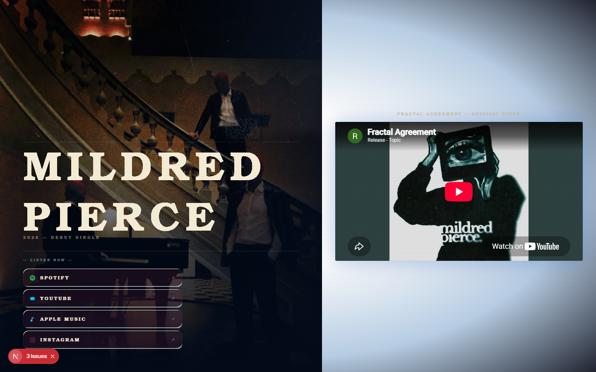

# Mildred Pierce

<p>   </p>

An interactive web game experience: a channel-surfing platformer built with Next.js, Three.js and Spline, with chapters, a tamagotchi companion, leaderboards and recording uploads.

## Features

- **Channel-surfing platformer** — the game (with EyeTV-style CRT presentation) is under `app/game`.
- **Tamagotchi companion** — a virtual pet page (`app/tamagotchi`) fed by an external Pi/Flask backend.
- **Chapters and meta-game** — signal map, hype, click events and score submission (`/api/signalmap`, `/api/hype`, `/api/click`, `/api/submit`, `/api/myscore`).
- **Leaderboards** — global scores via `@vercel/postgres`.
- **Recording upload** — players upload recordings (`/api/upload-recording`), posted to GitHub releases.
- **OG image generation** — dynamic share images (`/api/og`).
- **Heavy visual FX** — Three.js shaders, VHS/CRT/smoke backgrounds, custom cursor, liquid-glass buttons, morphing text, all with Framer Motion.
- **Registration** — player registration via `/api/register`.

## Tech stack

- Next.js 16 (App Router), React 19, TypeScript
- Three.js + @splinetool/runtime, Framer Motion
- Tailwind CSS, lucide-react, class-variance-authority
- @vercel/postgres, deployed on Vercel

## Getting started

```bash
npm install
npm run dev      # next dev
```

Production:

```bash
npm run build    # next build
npm start        # next start
```

## Environment variables

Copy `.env.local.example` to `.env.local`:

| Variable | Description |
|---|---|
| `NEXT_PUBLIC_TAMA_API` | Public URL of the tamagotchi backend (Flask server), e.g. `https://pi.yourdomain.ts.net` or `http://YOUR_PUBLIC_IP:5001` |

## Project structure

```
app/
├── page.tsx, layout.tsx          # landing page
├── game/                         # game: EyeTVPage.tsx, page.tsx
├── tamagotchi/page.tsx           # virtual pet page
└── api/                          # 9 routes
    ├── click, hype, leaderboard, myscore
    ├── register, signalmap, submit, upload-recording, og
components/ui/                    # FX components (shaders, VHS, CRT, tamagotchi EyeTV, ...)
lib/                              # colors.ts, utils.ts
public/                           # fonts, images, og-image.jpg
```

## Tests

No automated tests configured. Lint:

```bash
npm run lint      # next lint
```

## Status

Active. 128 commits, repo `HermannPR/MildredPierce`. Live at `https://mildred-pierce.vercel.app`.

## Screenshots


