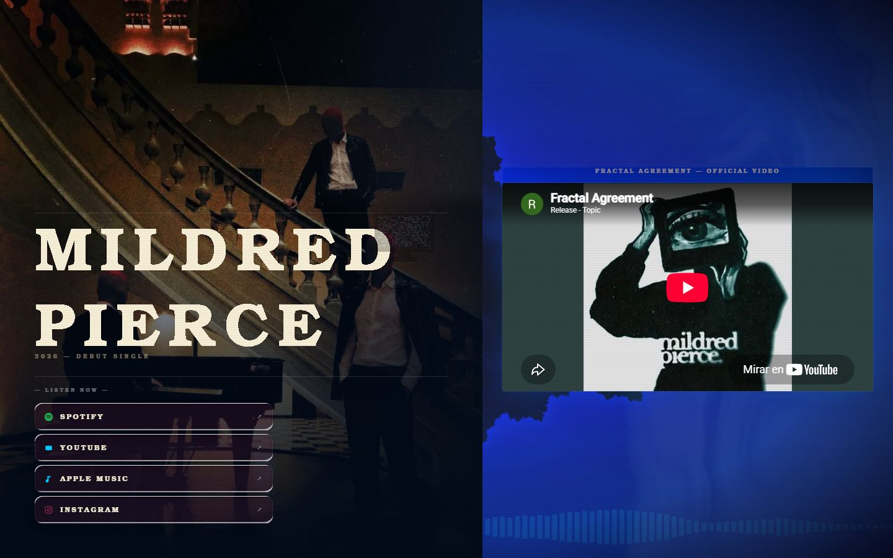
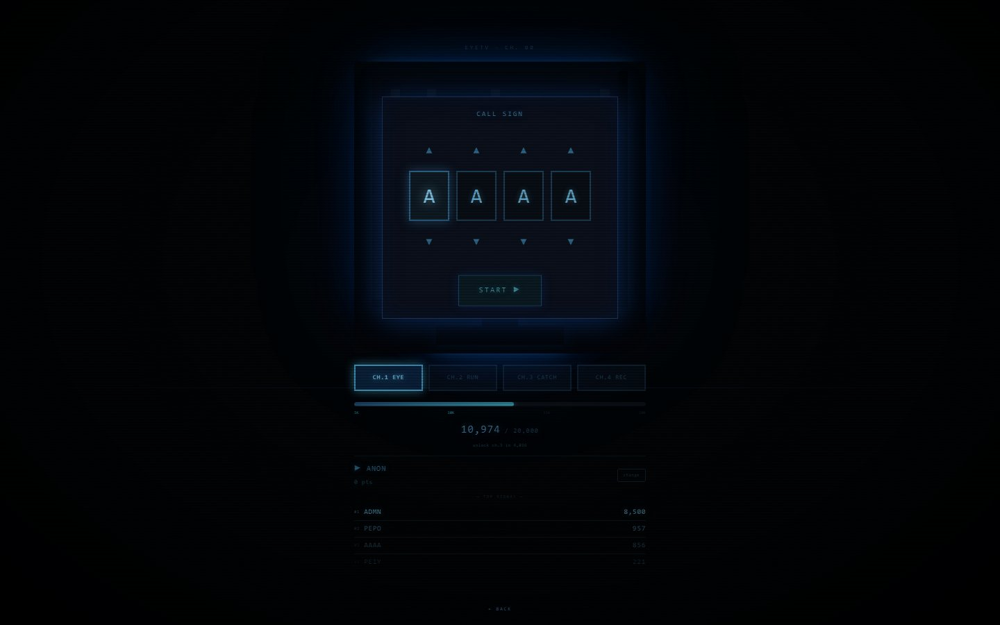
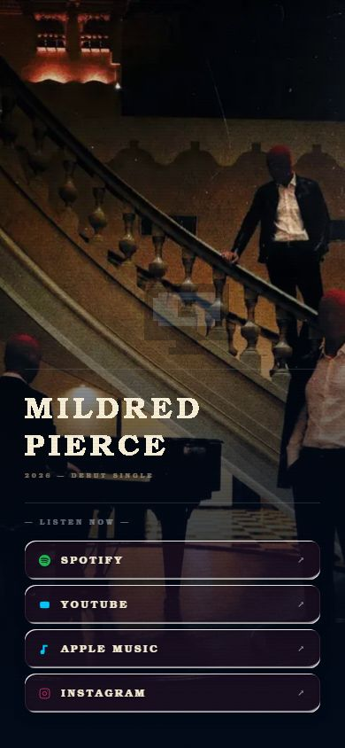

# Mildred Pierce: EYETV

Sitio web de la banda Mildred Pierce. Tiene la página de su sencillo debut y EYETV, un juego en el navegador con estilo de televisión CRT, pensado para los fans de la banda.

**Sitio en vivo:** https://mildred-pierce.vercel.app (el juego está en https://mildred-pierce.vercel.app/game)







## Qué incluye

- Página principal con video del sencillo, enlaces a Spotify, YouTube, Apple Music e Instagram y efectos visuales con shaders.
- Juego EYETV con cuatro canales, indicativo de cuatro letras y marcador global compartido entre todos los jugadores.
- Tabla de posiciones y puntaje personal, guardados en Postgres.
- Los jugadores pueden subir la grabación de su partida, que se guarda en un release de GitHub.
- Imágenes para compartir generadas al momento (`/api/og`).
- Página de mascota virtual que se conecta a un servidor Flask en una Raspberry Pi.

## Tecnologías

- Next.js 16 (App Router), React 19 y TypeScript
- Three.js, Spline y Framer Motion
- Tailwind CSS
- Vercel Postgres
- Vercel para el despliegue

## Cómo correrlo en local

```bash
npm install
cp .env.local.example .env.local
npm run dev
```

Se abre en http://localhost:3000. Las variables de `.env.local.example` son:

- `POSTGRES_URL`: conexión a Vercel Postgres
- `NEXT_PUBLIC_TAMAGOTCHI_API`: URL pública del servidor de la mascota virtual
- `GITHUB_TOKEN`: token del servidor para guardar grabaciones
- `GITHUB_REPO`: repositorio donde se guardan las grabaciones

Para producción: `npm run build` y luego `npm start`.

## Estructura

```
app/page.tsx       página principal
app/game/          juego EYETV
app/tamagotchi/    mascota virtual
app/api/           rutas: click, hype, leaderboard, myscore, register, signalmap, submit, upload-recording, og
components/ui/     efectos visuales (shaders, VHS, CRT)
```

Autor del diseño y el desarrollo: [Hermann Pauwells Rivera](https://hermannpr.github.io/)

## Licencia

[MIT](LICENSE). El nombre de la banda, la música y el arte pertenecen a Mildred Pierce.
