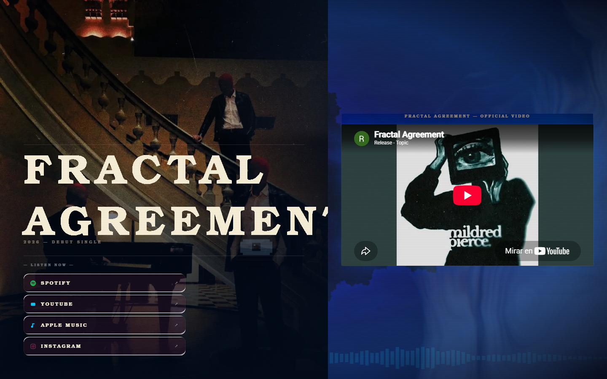
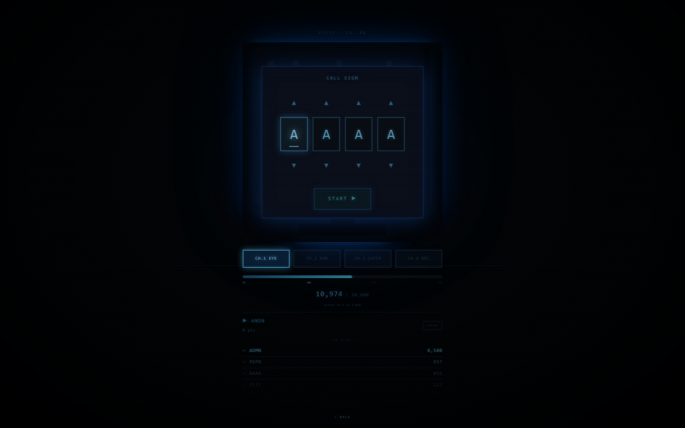
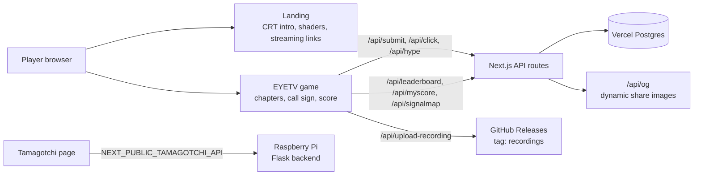

# Mildred Pierce: EYETV

> **EN:** Transmedia website for the band Mildred Pierce: a landing page for the debut single plus EYETV, a CRT-styled browser game with chapters, call signs, a shared global score and leaderboards, built with Next.js, Three.js and Vercel Postgres.
> **ES:** Sitio transmedia para la banda Mildred Pierce: landing del sencillo debut y EYETV, un juego web estilo televisión CRT con capítulos, marcador global compartido y leaderboards.

<p>   </p>

**Live:** [mildred-pierce.vercel.app](https://mildred-pierce.vercel.app) · game at [/game](https://mildred-pierce.vercel.app/game)
**Design and development:** [Hermann Pauwells Rivera](https://hermannpr.github.io/)

| Landing (debut single) | EYETV game |
|---|---|
|  |  |

## How it fits together



## The hard part

Making a game that feels like a nostalgic TV but is actually a networked product. Behind the Three.js shaders (CRT scanlines, VHS noise, smoke, morphing text) are real API routes: score submission and leaderboards backed by `@vercel/postgres`, a `/api/register` flow, dynamic OG images, and a way for players to upload a recording of their run that lands in a GitHub release. The companion is fed by a separate Raspberry Pi/Flask backend, so the game has to stay fun while quietly talking to services.

It's deployed and playable at [mildred-pierce.vercel.app](https://mildred-pierce.vercel.app), and that is the part I'm happiest about. It's not a demo, it's a shipped thing someone can actually play.

## Features

- **Channel-surfing platformer**: the game (with EyeTV-style CRT presentation) is under `app/game`.
- **Tamagotchi companion**: a virtual pet page (`app/tamagotchi`) fed by an external Pi/Flask backend.
- **Chapters and meta-game**: signal map, hype, click events and score submission (`/api/signalmap`, `/api/hype`, `/api/click`, `/api/submit`, `/api/myscore`).
- **Leaderboards**: global scores via `@vercel/postgres`.
- **Recording upload**: players upload recordings (`/api/upload-recording`), posted to GitHub releases.
- **OG image generation**: dynamic share images (`/api/og`).
- **Heavy visual FX**: Three.js shaders, VHS/CRT/smoke backgrounds, custom cursor, liquid-glass buttons, morphing text, all with Framer Motion.
- **Registration**: player registration via `/api/register`.

## Tech stack

- Next.js 16 (App Router), React 19, TypeScript
- Three.js + @splinetool/runtime, Framer Motion
- Tailwind CSS, lucide-react, class-variance-authority
- @vercel/postgres, deployed on Vercel

## Getting started

```bash
npm install
npm run dev      # next dev
```

Production:

```bash
npm run build    # next build
npm start        # next start
```

## Environment variables

Copy `.env.local.example` to `.env.local`:

| Variable | Description |
|---|---|
| `NEXT_PUBLIC_TAMAGOTCHI_API` | Public URL of the tamagotchi backend (Flask server), e.g. `https://pi.yourdomain.ts.net` |
| `POSTGRES_URL` | Vercel Postgres connection string (set automatically when the store is linked in Vercel) |
| `GITHUB_TOKEN` | Server-only token with `contents:write` on the repo that stores recordings |
| `GITHUB_REPO` | Repo for recordings, defaults to `HermannPR/MildredPierce` |

## Project structure

```
app/
├── page.tsx, layout.tsx          # landing page
├── game/                         # game: EyeTVPage.tsx, page.tsx
├── tamagotchi/page.tsx           # virtual pet page
└── api/                          # 9 routes
    ├── click, hype, leaderboard, myscore
    ├── register, signalmap, submit, upload-recording, og
components/ui/                    # FX components (shaders, VHS, CRT, tamagotchi EyeTV, ...)
lib/                              # colors.ts, utils.ts
public/                           # fonts, images, og-image.jpg
```

## Tests

No automated tests configured. Lint:

```bash
npm run lint      # next lint
```

## Status

Live and maintained; 135 commits.

## License

[MIT](LICENSE). Band name, music and artwork belong to Mildred Pierce.
